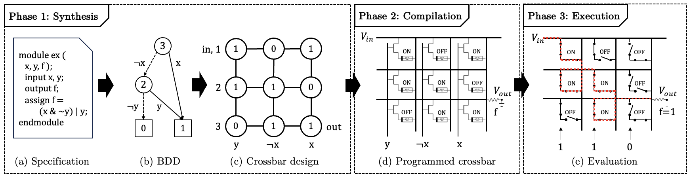
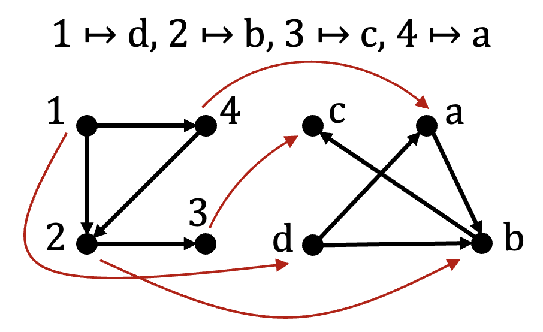
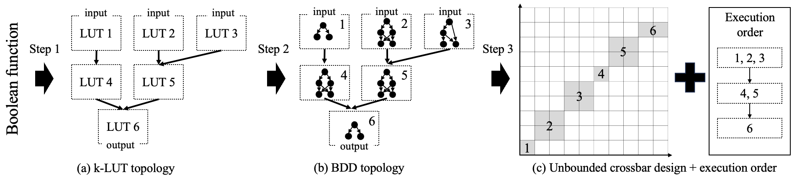
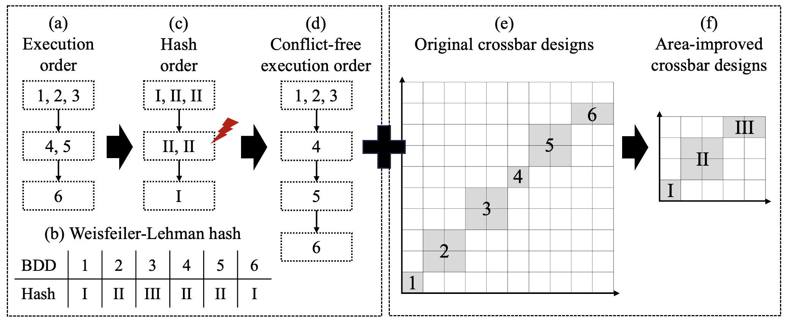
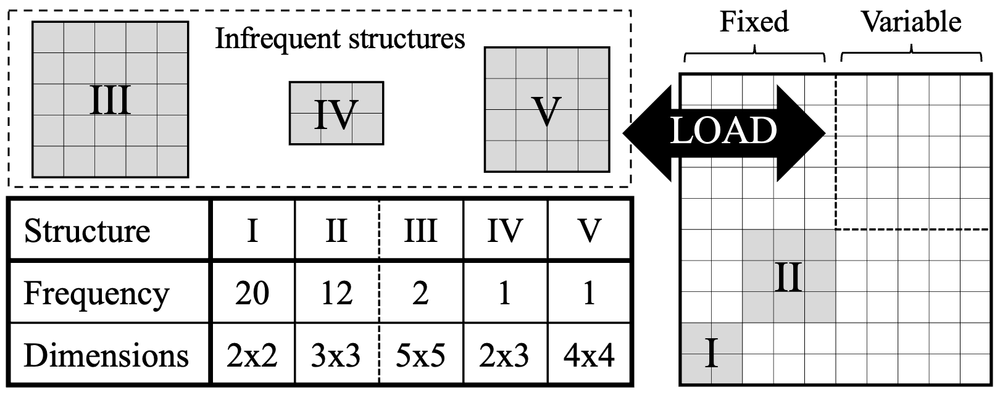

# Towards Area-Efficient Path-Based In-Memory Computing using Graph Isomorphisms

ISO is  part of the [MemX](https://github.com/sventhijssen/memx) digital in-memory computing package. MemX supports both flow-based in-memory computing and path-based in-memory computing.

## Citation
When using our repository or building further upon our work, please cite our paper:

```
Thijssen, S., Rashed, M., Zheng, H., Jha, S. K., & Ewetz, R. Towards Area-Efficient Path-Based In-Memory Computing using Graph Isomorphisms. ASP-DAC 2024.
```

## Introduction
### Path-based computing
Path-based computing is a digital in-memory computing paradigm on 1T1M crossbars. The computing paradigm consists of three steps, as shown in Figure 1.
1. Synthesis: Given a specification in Verilog, the Boolean function is converted into a BDD.
Next, the BDD is mapped into a crossbar design using the PATH synthesis method [1].
A crossbar design is an assignment of Boolean literals (Boolean variables and their negations) to the selectorlines, and Boolean truth values (0/1) to the memristors.
2. Compilation: Based on the crossbar design, the memristors are programmed _once_ to either a low resistive state (LRS/1) or high resistive state (HRS/0).
3. Execution: Given an input vector, i.e. assignment of Boolean truth values to the Boolean variables, the selectorlines are charged according to truth value of the input variables.
Depending on the charge, the access transistors connected to the selectorlines will open (0) / close (1), respectively.
Then, a high input voltage is applied to the input wordline and the output wordline is grounded. An electrical current now flows through the crossbar.
When there is a path from input to output through memristors in LRS and closed access transistors, then the Boolean function evaluates to true. Otherwise, the Boolean function evaluates to false.


<br>
Figure 1: Path-based computing. Image taken from [2].

[1] Thijssen, S., Jha, S. K., & Ewetz, R. (2022, July). Path: Evaluation of boolean logic using path-based in-memory computing. In Proceedings of the 59th ACM/IEEE Design Automation Conference (pp. 1129-1134).
<br>
[2] Thijssen, S., Rashed, M., Zheng, H., Jha, S. K., & Ewetz, R. Towards Area-Efficient Path-Based In-Memory Computing using Graph Isomorphisms. ASP-DAC 2024. (accepted)

### Problem formulation
The state-of-the-art synthesis method for path-based computing, PATH, synthesizes a Boolean function into a single BDD and subsequently maps the BDD to a crossbar.
This methodology has two drawbacks:

1. A posteriori partitioning
2. Large crossbar designs

### Overview of the ISO framework
We have observed that path-based computing preserves the structure of the synthesized Boolean function. 
This gives the opportunity to reuse the same hardware resources for Boolean functions that share the same structure.
To accomplish this, we use k-LUTs for the following reasons:

1. Allows a priori partitioning
2. Allows hardware reuse using _graph isomorphism_


<br>
Figure 2: Isomorphic graphs. Image taken from [1].

The framework consists of steps:
1. Synthesis of a Boolean function using k-LUTs
2. Area-improved synthesis using graph isomorphisms
3. Area-constrained synthesis

[1] Thijssen, S., Rashed, M., Zheng, H., Jha, S. K., & Ewetz, R. Towards Area-Efficient Path-Based In-Memory Computing using Graph Isomorphisms. ASP-DAC 2024. (accepted)

### 1. Synthesis of a Boolean function using k-LUTs
In the first step, we illustrate how a Boolean function is synthesized into a crossbar design using k-LUTs.
Each LUT is converted into a BDD and subsequently mapped into a small crossbar design using the PATH synthesis method.
This also brings with it that an execution order of EVAL instructions is needed for the LUTs.


<br>
Figure 3: Synthesis using k-LUTs. Image taken from [1].

[1] Thijssen, S., Rashed, M., Zheng, H., Jha, S. K., & Ewetz, R. Towards Area-Efficient Path-Based In-Memory Computing using Graph Isomorphisms. ASP-DAC 2024. (accepted)

### 2. Area-improved synthesis using graph isomorphisms
In the second step, we make use of graph isomorphisms to map different Boolean functions to the same hardware resources.
Using the Weisfeiler-Lehman graph, we determine which graphs are isomorphic.
Parallel execution of LUTs with the same hash is not permitted, as they share the same resource.
Hence, the execution order must be updated such that it is conflict-free.


<br>
Figure 4: Area improvement using graph isomorphisms. Image taken from [1].

[1] Thijssen, S., Rashed, M., Zheng, H., Jha, S. K., & Ewetz, R. Towards Area-Efficient Path-Based In-Memory Computing using Graph Isomorphisms. ASP-DAC 2024. (accepted)

### 3. Area-constrained synthesis
In the third step, we take into account dimensional constraints of the crossbar.
When crossbar dimensions are provided, we count the number of occurrences (frequency) for each structure.
Next, we permanently assign those structures that occur the most (fixed) such that there is enough space for those structures that will not be assigned permanently (variable).
During execution, the infrequent structures will be swapped out when needed using LOAD instructions.


<br>
Figure 5: Area-constrained synthesis. Image taken from [2].

[1] Thijssen, S., Rashed, M., Zheng, H., Jha, S. K., & Ewetz, R. Towards Area-Efficient Path-Based In-Memory Computing using Graph Isomorphisms. ASP-DAC 2024. (accepted)

## Publications
- Thijssen, S., Rashed, M., Zheng, H., Jha, S. K., & Ewetz, R. Towards Area-Efficient Path-Based In-Memory Computing using Graph Isomorphisms. ASP-DAC 2024. (accepted)
- Thijssen, S., Jha, S. K., & Ewetz, R. (2022, July). [Path: Evaluation of boolean logic using path-based in-memory computing](https://dl.acm.org/doi/pdf/10.1145/3489517.3530596). In Proceedings of the 59th ACM/IEEE Design Automation Conference (pp. 1129-1134).

## Related work
- Thijssen, S., Rashed, M., Jha, S. K., & Ewetz, R. READ-based In-Memory Computing using Sentential Decision Diagrams. ASP-DAC 2024. (accepted)
- Thijssen, S., Rashed, M., Singireddy, S., Jha, S. K., & Ewetz, R. Verification of Flow-Based Computing Systems using Bounded Model Checking. In 42nd International Conference on Computer-Aided Design (ICCAD) 2023. (accepted)
- Thijssen, S., Rashed, M., Jha, S. K., & Ewetz, R. UpTime: Towards Flow-based In-Memory Computing with High Fault-Tolerance, In 59th Design Automation Conference (DAC), 2023 (accepted).
- Thijssen, S., Jha, S. K., & Ewetz, R. (2023, January). [FLOW-3D: Flow-Based Computing on 3D Nanoscale Crossbars with Minimal Semiperimeter](https://ieeexplore.ieee.org/document/10044773/). In Proceedings of the 28th Asia and South Pacific Design Automation Conference (pp. 775-780).
- Thijssen, S., Jha, S. K., & Ewetz, R. (2022, October). [Equivalence Checking for Flow-Based Computing](https://ieeexplore.ieee.org/document/9978381). In 2022 IEEE 40th International Conference on Computer Design (ICCD) (pp. 656-663). IEEE.
- Thijssen, S., Jha, S. K., & Ewetz, R. (2021, December). [Compact: Flow-based computing on nanoscale crossbars with minimal semiperimeter and maximum dimension](https://ieeexplore.ieee.org/document/9662445). IEEE Transactions on Computer-Aided Design of Integrated Circuits and Systems, 41(11), 4600-4611.
- Thijssen, S., Jha, S. K., & Ewetz, R. (2021, February). [Compact: Flow-based computing on nanoscale crossbars with minimal semiperimeter](https://ieeexplore.ieee.org/document/9473995). In 2021 Design, Automation & Test in Europe Conference & Exhibition (DATE) (pp. 232-237). IEEE.

## Requirements

### Windows
- Install and enable [Windows Subsystem for Linux](https://docs.microsoft.com/en-us/windows/wsl/install-win10#install-windows-subsystem-for-linux). 
- Python 3.10 or higher

### Linux
- Python 3.10 or higher

### MacOS
- Python 3.10 or higher

## Installation

### Submodules
Clone this git repository and the required submodules [ABC](https://people.eecs.berkeley.edu/~alanmi/abc/). For ABC, make sure to clone the submodule from [here](https://github.com/sventhijssen/abc).
Clone the submodules using the following command:

```bash
git submodule update --init --recursive
```

#### ABC
Compile the ``ABC`` tool in the directory _abc_. 

```bash
cd abc
make
```

#### Python packages and dependencies
Use the package manager [pip](https://pip.pypa.io/en/stable/) to install the Python dependencies in ``requirements.txt``.

```bash
pip3 install -r requirements.txt
```

## Usage
For examples on how to use the ISO framework, please refer to the [_examples_](examples) directory where the framework is explained step-by-step.
Additionally, the files [experiments/iscas85/iscas85.py](experiments/iscas85/iscas85.py) and [experiments/dimensions/iscas85/iscas85.py](experiments/dimensions/iscas85/iscas85.py) may be helpful.

## Version
ISO version 1.0.0

## Contact
_Sven Thijssen  
University of Central Florida  
sven.thijssen (at) ucf.edu  
https://www.sventhijssen.com/_

## Additional references
- Brayton, R., & Mishchenko, A. (2010). [ABC: An academic industrial-strength verification tool](https://link.springer.com/chapter/10.1007/978-3-642-14295-6_5). In Computer Aided Verification: 22nd International Conference, CAV 2010, Edinburgh, UK, July 15-19, 2010. Proceedings 22 (pp. 24-40). Springer Berlin Heidelberg.
- Brglez, F. (1985). A neutral netlist of 10 combinational benchmark circuits and a target translator in Fortran. In Proc. Intl. Symp. Circuits and Systems, 1985.
- Shervashidze, N., Schweitzer, P., Van Leeuwen, E. J., Mehlhorn, K., & Borgwardt, K. M. (2011). Weisfeiler-lehman graph kernels. Journal of Machine Learning Research, 12(9).

## License
    Copyright 2023 Sven Thijssen

    Licensed under the Apache License, Version 2.0 (the "License");
    you may not use this file except in compliance with the License.
    You may obtain a copy of the License at

        http://www.apache.org/licenses/LICENSE-2.0

    Unless required by applicable law or agreed to in writing, software
    distributed under the License is distributed on an "AS IS" BASIS,
    WITHOUT WARRANTIES OR CONDITIONS OF ANY KIND, either express or implied.
    See the License for the specific language governing permissions and
    limitations under the License.